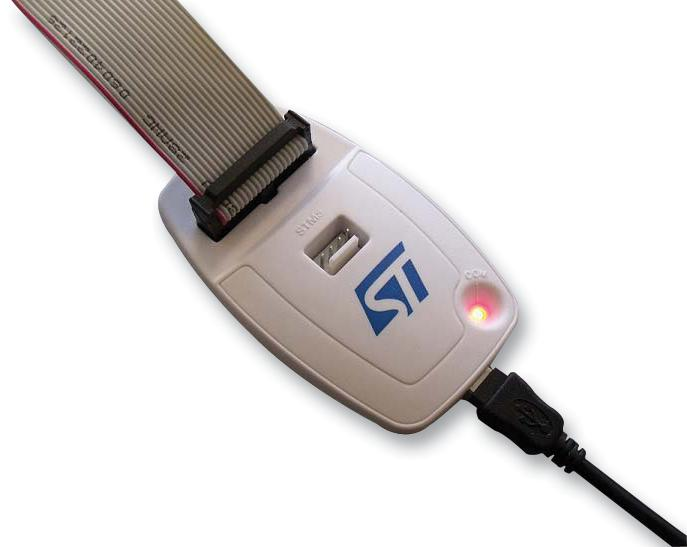
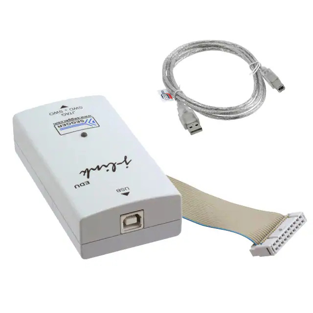

# Introduction

This project is meant to test low-power embedded system over wireless communication such LoRaWAN.
Based on [Mbed platform](https://os.mbed.com/) and 
  [EmOne's STM32L151x controller](https://www.emone.co.th/product/imas923th-mikrobus-shield-v2/?v=cb21c4d7dea9),
  modules:
  [HX711](https://cdn.sparkfun.com/datasheets/Sensors/ForceFlex/hx711_english.pdf),
  [ADS1232](https://www.ti.com/product/ADS1232), and
  [ADS1220](https://www.ti.com/product/ADS1220) have been used for recording and streaming weights over the network.


# Wiring Diagram


# Using

All helper scripts are placed in _scripts_ directory.
* To compile code: ```scripts/compile.sh```
* To flash firmware, it depends on your programmer:
    * __ST-Link__: use the ```scripts/flash.sh```
    which commands with the ST-Flash software.
    

    * __SEGGER's J-Link V2__: use the ```scripts/j-flash.sh```
    which commands with the SEGGER's J-Flash software.
    


# Experiment

## Design

x


## Setup

x


## Result

x


## Conclusion

x


# Notes

## Mbed Framework

* After ```mbed import``` a library into the project, 
please command ```mbed deploy``` consecutively.
