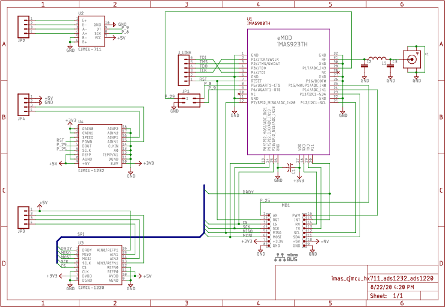

# Introduction

This project is meant to test low-power embedded system over wireless communication such LoRaWAN.
Based on [Mbed platform](https://os.mbed.com/) and 
  [EmOne's STM32L151x controller](https://www.emone.co.th/product/imas923th-mikrobus-shield-v2/?v=cb21c4d7dea9),
  modules:
  [HX711](https://cdn.sparkfun.com/datasheets/Sensors/ForceFlex/hx711_english.pdf),
  [ADS1232](https://www.ti.com/product/ADS1232), and
  [ADS1220](https://www.ti.com/product/ADS1220) have been used for recording and streaming weights over the network.


# Wiring Diagram

[](documents/eagle/imas_cjmcu_hx711_ads1232_ads1220.pdf)
* [Download (EaglePCB Schematic)](documents/eagle/imas_cjmcu_hx711_ads1232_ads1220.sch)


# Using

All helper scripts are placed in _scripts_ directory.
* To compile code: ```scripts/compile.sh```
* To flash firmware, it depends on your programmer:
    * __ST-Link__: use the ```scripts/flash_stlink.sh```
    which commands with the ST-Flash software.
    

    * __SEGGER's J-Link V2__: use the ```scripts/flash_jlink.sh```
    which commands with the SEGGER's J-Flash software.
    


# Experiment

[The result](experiment/adcs_hx711_ads1232_ads1220_precision_test.ipynb)


# Notes

## Mbed Framework

* After ```mbed import``` a library into the project, 
please command ```mbed deploy``` consecutively.

* [Tracking Memory Usage in Mbed-OS](https://os.mbed.com/blog/entry/Tracking-memory-usage-with-Mbed-OS/)

## LoRaWAN & Gateway

* [SSH to the Gateway](https://docs.rakwireless.com/Product-Categories/WisGate/RAK7243C/Quickstart/#accessing-your-gateway)
* [Connect Gateway to the Internet](https://docs.rakwireless.com/Product-Categories/WisGate/RAK7243C/Quickstart/#accessing-the-internet)
* [Using Built-in ChirpStack](https://docs.rakwireless.com/Product-Categories/WisGate/RAK7243C/Quickstart/#connect-the-gateway-with-chirpstack)
* [Firmware of the node](https://os.mbed.com/teams/mbed-os-examples/code/mbed-os-example-lorawan/)
    * Edit the configuration in _mbed_app.json_ file.

